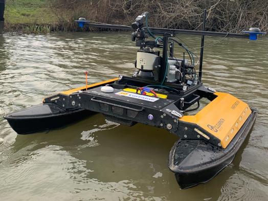

# Reinforcement Learning Framework for Autonomous Surface Vehicles (ASV)

## About this repository

This repository contains the implementation and simulation environment used in the research paper "Advancing ASV Autonomy for Environmental Cleanup: A Deep Reinforcement Learning Framework for Floating Waste Capture." It extends the RANS (Reinforcement Learning Autonomous Navigating Systems) (https://github.com/elharirymatteo/RANS/tree/main) framework, integrating buoyancy and hydrodynamics models for efficient ASV training and operation.

Our framework includes a highly parallelized environment with domain randomization and system identification techniques to bridge the sim-to-real gap for ASV applications. This repository aims to support ASV autonomy, particularly for tasks such as floating waste capture and contributing to environmental conservation efforts.

| Without Water Visualization | With Water Visualization |
| :-: | :-: |
|  |  | 

---

## How to run - For Quick TEST
1. **Training** 
  PYTHON_PATH scripts/rlgames_train.py task=USV/IROS2024/USV_Virtual_CaptureXY_SysID-TEST train=USV/USV_PPOcontinuous_MLP headless=True enable_livestream=True experiment=Capture-TEST

2. **Test**
  PYTHON_PATH scripts/rlgames_train.py task=USV/IROS2024/USV_Virtual_CaptureXY_SysID-TEST train=USV/USV_PPOcontinuous_MLP test=True checkpoint=runs/Capture-TEST/nn/Capture-TEST.pth num_envs=32


## Task Description - Capture + @

Currently, we provide main task capture, which was highlighted in the paper, with minor tasks GoToPose, KeepXY, TrackXYVelocity, and TrackXYOVelocity, which could be run with minor updates as well. :

1. **Capture Task for ASV:**
   The "Capture" task is formulated to simulate the activity of an ASV in pursuing and collecting water floating waste autonomously in a two-dimensional space. The ASV must effectively navigate towards a predefined target, and capture it by passing over the target with precision.

   Successful capture is defined by the ASV's alignment and transit over the target with a maximum deviation of 0.3 meters(0.1 in training) from its center of mass to the target. The test environment is obstacle-free, with a realistic operational range of 10 meters and a field of view restricted to 90 degrees, mirroring the potential future use of onboard cameras for target detection.

2. **Further possible tasks:**
   These tasks provide additional training scenarios for the ASV that can be utilized with minimal adjustments:
   
   The minor tasks defined are:
   - **GoToPose:** This task focuses on position-attitude control, where the ASV must navigate to a specific location and orientation in the two-dimensional space.
   - **KeepXY:** In This task, the ASV is required to maintain its position within a specified XY coordinate against disturbances.
   - **TrackXYVelocity** This task challenges the ASV to match and maintain a set linear velocity along the XY plane.
   - **TrackXYOVelocity** An extension of the "TrackXYVelocity" task, this scenario additionally incorporates angular velocity tracking.

#### ASV Configuration
For real-world deployment, The Kingfisher ASV with a catamaran design, 1.35m long and 0.98m wide, weighing 35.96kg was used. It's powered by two hull-mounted thrusters, controlled at a frequency of at least 10 Hz. Processing is handled by an NVIDIA Jetson Xavier, and energy is supplied by a 22 Ah 4-cell LiPo battery. Localization uses an SBG Ellipse-D IMU and RTK GPS, providing high precision in position (0.02m), velocity (0.03m/s), and heading (0.5°). Sensors like cameras and lasers were present but not utilized for these tests. The training environment mimics the sensor noise.

| ASV in Isaac Environment | ASV in Real Environment |
| :-: | :-: |
|  |  |

---
## Installation

Follow the Isaac Sim [documentation](https://docs.omniverse.nvidia.com/isaacsim/latest/installation/index.html) to install the 2022.2.1 Isaac Sim release. 

*Examples in this repository rely on features from the 2022.2.1 Isaac Sim release. Please make sure to match the correct version.*

### OmniverseIsaacGymEnvs
Once installed, this repository can be used as a python module, `omniisaacgymenvs`, with the python executable provided in Isaac Sim.

To install `omniisaacgymenvs`, first clone this repository:

```bash
git clone https://github.com/JunghwanRo/RANS-ASV-IROS2024.git
```

Once cloned, locate the [python executable in Isaac Sim](https://docs.omniverse.nvidia.com/app_isaacsim/app_isaacsim/install_python.html). By default, this should be `python.sh`. We will refer to this path as `PYTHON_PATH`.

To set a `PYTHON_PATH` variable in the terminal that links to the Python executable, we can run a command that resembles the following. Make sure to update the paths to your local path.

```
For Linux: alias PYTHON_PATH=~/.local/share/ov/pkg/isaac_sim-*/python.sh
For Windows: doskey PYTHON_PATH=C:\Users\user\AppData\Local\ov\pkg\isaac_sim-*\python.bat $*
For IsaacSim Docker: alias PYTHON_PATH=/isaac-sim/python.sh
```

Install `omniisaacgymenvs` as a Python module for `PYTHON_PATH`:

```bash
PYTHON_PATH -m pip install -e .
```

### RL Games

We use the [rl-games](https://pypi.org/project/rl-games/1.0.2/) library as a starting point to rework the PPO implementation for the agents we train.

To install the appropriate version of rl-games, clone this repository:
```bash
git clone https://github.com/AntoineRichard/rl_games
```
Make sure to install the rl_gamers library under the OmniverseIsaacGym dependence:
```
PYTHON_PATH -m pip install rl_games .
```

## Running the examples

*Note: All commands should be executed from `OmniIsaacGymEnvs/omniisaacgymenvs`.*

<details>
<summary><span style="font-size: 1.3em; font-weight: bold;">Training new agents</span></summary>


To train your first policy, run:

```bash
PYTHON_PATH scripts/rlgames_train.py task=USV/IROS2024/USV_Virtual_CaptureXY_SysID-TEST train=USV/USV_PPOcontinuous_MLP
```

You should see an Isaac Sim window pop up. Once Isaac Sim's initialization is complete, the scene will be constructed, and the simulation will start running automatically. The process will terminate once training finishes.

Note that by default, we show a Viewport window with rendering, which slows down training. You can choose to close the Viewport window during training for better performance. The Viewport window can be re-enabled by selecting `Window > Viewport` from the top menu bar.

To achieve maximum performance, you can launch training in `headless` mode as follows:

```bash
PYTHON_PATH scripts/rlgames_train.py task=USV/IROS2024/USV_Virtual_CaptureXY_SysID-TEST train=USV/USV_PPOcontinuous_MLP headless=True
```

#### A Note on the Startup Time of the Simulation

Some of the examples could take a few minutes to load because the startup time scales based on the number of environments. The startup time will continually
be optimized in future releases. 

#### Water Visualization

If you want to activate water visualization, you can activate it in the config .yaml file, 'waterVisualization' to True.

</details>

<details>
<summary><span style="font-size: 1.3em; font-weight: bold;">Loading trained models (or checkpoints)</span></summary>

Checkpoints are saved in the folder `runs/EXPERIMENT_NAME/nn` where `EXPERIMENT_NAME` 
defaults to the task name but can also be overridden via the `experiment` argument.

To load a trained checkpoint and continue training, use the `checkpoint` argument:

```bash
PYTHON_PATH scripts/rlgames_train.py task=USV/IROS2024/USV_Virtual_CaptureXY_SysID-TEST train=USV/USV_PPOcontinuous_MLP checkpoint=runs/Capture-TEST/nn/Capture-TEST.pth
```

To load a trained checkpoint and only perform inference (no training), pass `test=True` 
as an argument, along with the checkpoint name. To avoid rendering overhead, you may 
also want to run with fewer environments using `num_envs=64`:

```bash
PYTHON_PATH sscripts/rlgames_train.py task=USV/IROS2024/USV_Virtual_CaptureXY_SysID-TEST train=USV/USV_PPOcontinuous_MLP checkpoint=runs/Capture-TEST/nn/Capture-TEST.pth test=True num_envs=64
```

Note that if there are special characters such as `[` or `=` in the checkpoint names, 
you will need to escape them and put quotes around the string. For example,
`checkpoint="runs/Ant/nn/last_Antep\=501rew\[5981.31\].pth"`
</details>

## Training Scripts

All scripts provided in `omniisaacgymenvs/scripts` can be launched directly with `PYTHON_PATH`.

<details>
<summary><span style="font-size: 1.3em; font-weight: bold;">Random policy</span></summary>
To test out a task without RL in the loop, run the random policy script with:

```bash
PYTHON_PATH scripts/random_policy.py USV/IROS2024/USV_Virtual_CaptureXY_SysID-TEST
```

This script will sample random actions from the action space and apply these actions to your task without running any RL policies. Simulation should start automatically after launching the script, and will run indefinitely until terminated.
</details>

<details>
<summary><span style="font-size: 1.3em; font-weight: bold;">Train on single GPU</span></summary>
To run a simple form of PPO from `rl_games`, use the single-threaded training script:

```bash
PYTHON_PATH scripts/rlgames_train.py USV/IROS2024/USV_Virtual_CaptureXY_SysID-TEST
```

This script creates an instance of the PPO runner in `rl_games` and automatically launches training and simulation. Once training completes (the total number of iterations have been reached), the script will exit. If running inference with `test=True checkpoint=<path/to/checkpoint>`, the script will run indefinitely until terminated. Note that this script will have limitations on interaction with the UI.
</details>

<details>
<summary><span style="font-size: 1.3em; font-weight: bold;">Train on multiple GPUs</span></summary>
Lastly, we provide a multi-threaded training script that executes the RL policy on a separate thread from the main thread used for simulation and rendering:

```bash
PYTHON_PATH scripts/rlgames_train_mt.py USV/IROS2024/USV_Virtual_CaptureXY_SysID-TEST
```

This script uses the same RL Games PPO policy as the above but runs the RL loop on a new thread. Communication between the RL thread and the main thread happens on threaded Queues. The simulation will start automatically, but the script will **not** exit when training terminates, except when running in headless mode. Simulation will stop when training completes or can be stopped by clicking on the Stop button in the UI. Training can be launched again by clicking on the Play button. Similarly, if running inference with `test=True checkpoint=<path/to/checkpoint>`, simulation will run until the Stop button is clicked, or the script will run indefinitely until the process is terminated.
</details>

<details>
<summary><span style="font-size: 1.3em; font-weight: bold;">Configuration and command line arguments</span></summary>

We use [Hydra](https://hydra.cc/docs/intro/) to manage the config.
 
Common arguments for the training scripts are:

* `task=TASK` - Select which task to use. Any of `USV_Virtual_CaptureXY`, `USV_Virtual_GoToPose`, `USV_Virtual_TrackXYVelocity`, `USV_Virtual_TrackXYOVelocity`, (these correspond to the config for each environment in the folder `omniisaacgymenvs/cfg/task/USV`)
* `train=TRAIN` - Select which training config to use. Will automatically default to the correct config for the environment (ie. `<TASK>PPO`).
* `num_envs=NUM_ENVS` - Selects the number of environments to use (overriding the default number of environments set in the task config).
* `seed=SEED` - Sets a seed value for randomization and overrides the default seed in the task config
* `pipeline=PIPELINE` - Which API pipeline to use. Defaults to `gpu`, can also set to `cpu`. When using the `gpu` pipeline, all data stays on the GPU. When using the `cpu` pipeline, simulation can run on either CPU or GPU, depending on the `sim_device` setting, but a copy of the data is always made on the CPU at every step.
* `sim_device=SIM_DEVICE` - Device used for physics simulation. Set to `gpu` (default) to use GPU and to `cpu` for CPU.
* `device_id=DEVICE_ID` - Device ID for GPU to use for simulation and task. Defaults to `0`. This parameter will only be used if simulation runs on GPU.
* `rl_device=RL_DEVICE` - Which device / ID to use for the RL algorithm. Defaults to `cuda:0`, and follows PyTorch-like device syntax.
* `test=TEST`- If set to `True`, only runs inference on the policy and does not do any training.
* `checkpoint=CHECKPOINT_PATH` - Path to the checkpoint to load for training or testing.
* `headless=HEADLESS` - Whether to run in headless mode.
* `experiment=EXPERIMENT` - Sets the name of the experiment.
* `max_iterations=MAX_ITERATIONS` - Sets how many iterations to run for. Reasonable defaults are provided for the provided environments.

Hydra also allows setting variables inside config files directly as command-line arguments. For example, to set the minibatch size for an rl_games training run, you can use `train.params.config.minibatch_size=64`. Similarly, variables in task configs can also be set. For example, `task.env.episodeLength=100`.

#### Hydra Notes

Default values for each of these are found in the `omniisaacgymenvs/cfg/config.yaml` file.

The way that the `task` and `train` portions of the config work is through the use of config groups. 
You can learn more about how these work [here](https://hydra.cc/docs/tutorials/structured_config/config_groups/)
The actual configs for `task` are in `omniisaacgymenvs/cfg/task/<TASK>.yaml` and for `train` in `omniisaacgymenvs/cfg/train/<TASK>PPO.yaml`. 

In some places in the config, you will find other variables referenced (for example,
 `num_actors: ${....task.env.numEnvs}`). Each `.` represents going one level up in the config hierarchy.
 This is documented fully [here](https://omegaconf.readthedocs.io/en/latest/usage.html#variable-interpolation).

</details>

### Tensorboard

Tensorboard can be launched during training via the following command:
```bash
PYTHON_PATH -m tensorboard.main --logdir runs/EXPERIMENT_NAME/summaries
```

## WandB support

You can run (WandB)[https://wandb.ai/] with OmniIsaacGymEnvs by setting `wandb_activate=True` flag from the command line. You can set the group, name, entity, and project for the run by setting the `wandb_group`, `wandb_name`, `wandb_entity` and `wandb_project` arguments. Make sure you have WandB installed in the Isaac Sim Python executable with `PYTHON_PATH -m pip install wandb` before activating.

## Citation 
If you use the current repository in your work, we suggest citing the following papers:

```bibtex
@article{batista2024advancing,
  title={Advancing ASV Autonomy for Environmental Cleanup: A Deep Reinforcement Learning Framework for Floating Waste Capture},
  author={Batista, Luis F. W. and Ro, Junghwan and Richard, Antoine and Schroepfer, Pete and Hutchinson, Seth and Pradalier, Cedric},
  journal={To be published},
  year={2024}
}

@article{el2023rans,
  title={RANS: Highly-Parallelised Simulator for Reinforcement Learning based Autonomous Navigating Spacecrafts},
  author={El-Hariry, Matteo and Richard, Antoine and Olivares-Mendez, Miguel},
  journal={arXiv preprint arXiv:2310.07393},
  year={2023}
}
```

## Directory Structure

```bash
.
├── cfg
│   ├── controller                     # Optimal Controllers configurations
│   ├── hl_task                        # High-level task configurations
│   ├── task                           # Task configurations
│   │   └── USV                        # USV task configurations
│   └── train                          # Training configurations
│       └── USV                        # USV training configurations
├── checkpoints                        # Checkpoints for saved models
├── conf_runs                          # Configuration runs for training
├── demos                              # Demonstration files, gifs
├── envs
│   └── USV                            # Environment related to Buoyancy, Hydrodynamics
├── images                             # Image files
├── mujoco_envs
│   ├── controllers                    # Controllers for Mujoco environments
│   ├── environments                   # Mujoco environments
│   └── legacy                         # Legacy Mujoco environment files
├── notebooks                          # Jupyter notebooks
├── robots
│   ├── articulations                  # Articulation-related files
│   │   ├── utils                      # Utilities for articulations
│   │   └── views                      # Articulation views
│   └── usd                            # USD-related files
├── ros                                # ROS-related files
├── scripts                            # Utility scripts
├── skrl                               # Reinforcement learning utilities
├── tasks
│   ├── base                           # Base task implementations
│   ├── factory                        # Factory task configurations
│   │   └── yaml                       # YAML configurations for factory tasks
│   ├── shared                         # Shared task implementations
│   ├── utils                          # Task utility functions
│   └── USV                            # USV-related tasks
├── utils
│   ├── config_utils                   # Configuration utilities
│   ├── domain_randomization           # Domain randomization utilities
│   ├── hydra_cfg                      # Hydra configuration utilities
│   ├── rlgames                        # Utilities for rlgames
│   ├── terrain_utils                  # Terrain-related utilities
│   └── usd_utils                      # USD-related utilities
└── videos                             # Video files
```
